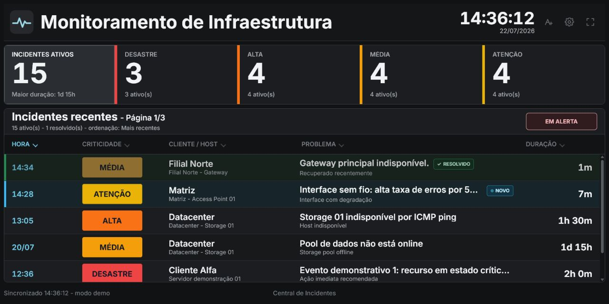

# Central de Incidentes

Painel web open source para exibir incidentes do Zabbix em TVs e telas de NOC com leitura rapida, configuracao simples e sem dependencia do Grafana.

O projeto consulta a API oficial do Zabbix, protege o token no backend e apresenta somente as informacoes que importam durante a operacao. A interface foi desenhada para funcionar a distancia, com tipografia legivel, severidades claras e paginacao automatica.

> Projeto independente da comunidade. Nao e afiliado, patrocinado ou mantido pela Zabbix LLC.



## Recursos

- Consulta de incidentes recentes pela API do Zabbix.
- Backend PHP que evita expor o token no navegador.
- Login administrativo e configuracoes salvas em MySQL/MariaDB.
- Protecao do painel e das APIs para usuarios nao autenticados.
- Severidades Atencao, Media, Alta e Desastre.
- Filtro de sintomas, eventos suprimidos, hosts, triggers e itens inativos.
- Incidentes ativos e resolvidos recentemente.
- Ultimos dados validos preservados quando a API fica indisponivel.
- Ordenacao por hora, criticidade, cliente/host, problema e duracao.
- Paginacao automatica de seis incidentes com intervalo configuravel.
- Transicoes de pagina configuraveis: sem efeito, fade, deslizar ou zoom suave.
- Temas Chumbo, Claro e Azul selecionaveis nas configuracoes, com Chumbo como padrao.
- Cores de criticidade personalizaveis com contraste automatico e restauracao da paleta padrao.
- Escala independente das fontes dos cards e da lista de incidentes, de 85% a 200% em passos de 5%.
- Ajuste rapido de fontes no proprio painel, com previa antes de aplicar.
- Destaques discretos para incidentes novos e resolvidos recentemente.
- Configuracao pelo botao no cabecalho ou pela tecla `F2`.
- Cenarios de demonstracao para validar o layout sem dados reais.

## Requisitos

- Linux Mint 21+, Ubuntu 22.04+ ou Debian 12+ para instalação automática no Linux.
- Apache ou Nginx.
- PHP 8.1 ou superior, com PDO MySQL, cURL e OpenSSL.
- MySQL 8+ ou MariaDB 10.4+.
- Zabbix 7 ou versao compativel com os metodos utilizados.
- Token da API com acesso aos hosts e problemas monitorados.

## Instalacao em um comando

Os comandos abaixo baixam o instalador oficial da release mais recente e iniciam o assistente. Ao final, o terminal mostra o endereco do wizard e um codigo temporario.

### Linux (Linux Mint 21+, Ubuntu 22.04+ ou Debian 12+)

Cole esta linha no terminal:

```bash
(arquivo=$(mktemp) && trap 'rm -f "$arquivo"' EXIT && wget -qO "$arquivo" https://github.com/matheusoliveirait/zabbix-monitor-tv/releases/latest/download/install.sh && sudo bash "$arquivo")
```

### Windows com Apache ou XAMPP

Abra o PowerShell, preferencialmente como administrador, e cole esta linha:

```powershell
& { $ErrorActionPreference = 'Stop'; [Net.ServicePointManager]::SecurityProtocol = [Net.SecurityProtocolType]::Tls12; $arquivo = Join-Path $env:TEMP ("central-incidentes-" + [guid]::NewGuid().ToString("N") + ".ps1"); try { Invoke-WebRequest 'https://github.com/matheusoliveirait/zabbix-monitor-tv/releases/latest/download/install-windows.ps1' -UseBasicParsing -OutFile $arquivo; powershell -NoProfile -ExecutionPolicy Bypass -File $arquivo } finally { Remove-Item $arquivo -Force -ErrorAction SilentlyContinue } }
```

O instalador apresenta as escolhas de porta, firewall, arquivos existentes e banco antes de realizar alteracoes.

No Linux, o instalador valida os repositórios e simula a resolução das dependências antes de instalar pacotes. Ele interrompe a operação quando encontra uma assinatura inválida, chave pública ausente ou dependências inconsistentes, sem desativar fontes externas nem remover pacotes automaticamente.

Se MySQL ou MariaDB já estiver instalado, o servidor existente é preservado e reutilizado. O instalador nunca troca automaticamente MySQL por MariaDB e executa o APT com remoções de pacotes bloqueadas.

Quando o acesso administrativo automático não está disponível, o instalador solicita temporariamente a senha do usuário `root` do MySQL/MariaDB. A senha não é exibida nem armazenada. Se o banco `central_incidentes` já existir, é possível preservá-lo ou excluir e recriar somente esse banco e seu usuário dedicado; os demais bancos nunca são alterados.

Se uma tentativa anterior tiver deixado uma pasta `central_incidentes` que o servidor não reconhece como banco, o instalador também a detecta. Ao recriar, essa pasta residual é arquivada com permissão restrita em `/var/backups/central-incidentes/` antes da criação do banco limpo.

## Decisoes seguras do instalador

### Porta e acesso pela rede

Quando nenhuma porta e informada, o instalador procura uma opcao disponivel entre `80`, `8080`, `8081` e `8888`. Em modo interativo, a porta encontrada pode ser aceita ou substituida.

A liberacao no firewall e opcional e vem desativada por padrao:

- No Windows, a regra permite somente o Apache, a sub-rede local e os perfis `Domain` e `Private`.
- No Linux, o instalador limita a regra a rede local detectada quando UFW esta ativo; com firewalld, utiliza a zona ativa.
- Se nenhum firewall compativel estiver ativo, o instalador informa que nenhuma regra foi alterada.

### Pasta de instalacao existente

Quando a pasta ja contem o painel, o instalador oferece:

1. **Atualizar arquivos:** preserva `config/app.php`, `config/installed.lock` e todo o banco.
2. **Reinstalar arquivos:** substitui o aplicativo e abre um novo wizard; o banco e tratado separadamente.
3. **Cancelar:** encerra sem alterar os arquivos.

Durante atualizacoes e reinstalacoes, os arquivos anteriores ficam em uma area temporaria. Se a operacao falhar, eles sao restaurados automaticamente.

Para automacao sem perguntas:

```bash
sudo ./install.sh --update --non-interactive
sudo ./install.sh --replace --non-interactive
```

```powershell
.\install-windows.ps1 -Update -NonInteractive
.\install-windows.ps1 -Replace -NonInteractive
```

### Banco existente

O instalador nunca altera silenciosamente a senha de um usuario de banco existente. Quando encontra o banco ou o usuario configurado, oferece:

1. Manter os dados e informar as credenciais no wizard.
2. Excluir o banco e o usuario para criar uma instalacao limpa.
3. Cancelar.

A exclusao exige digitar `EXCLUIR`. Ela apaga permanentemente as tabelas do banco selecionado. Em automacoes, essa escolha precisa ser explicita com `--reset-database` no Linux ou `-ResetDatabase` no Windows.

No passo 3 do wizard, **Usuario** e **Senha** sao credenciais do MySQL/MariaDB com acesso ao banco indicado. Nao sao o login do Zabbix nem a conta administrativa do painel. Em um XAMPP novo, `root` geralmente comeca sem senha, mas uma conta dedicada e recomendada.

## Instalacao manual assistida

Este caminho permite baixar e revisar o instalador antes da execucao.

### Linux (Linux Mint 21+, Ubuntu 22.04+ ou Debian 12+)

```bash
wget https://github.com/matheusoliveirait/zabbix-monitor-tv/releases/latest/download/install.sh
less install.sh
chmod +x install.sh
sudo ./install.sh
```

Ele prepara PHP, MariaDB, Apache ou Nginx, instala os arquivos e apresenta a URL do assistente com um codigo temporario:

```text
Servidor preparado com sucesso.

  Acesse:  http://192.168.1.50/setup/
  Codigo:  A1B2-C3D4-E5F6-G7H8
```

O codigo expira em duas horas. No navegador, o assistente valida o ambiente, prepara as tabelas, cria o administrador, testa o Zabbix e bloqueia o instalador.

Para escolher o servidor sem perguntas:

```bash
sudo ./install.sh --apache --non-interactive
sudo ./install.sh --nginx --non-interactive
sudo ./install.sh --apache --port 8090 --non-interactive
```

Quando nenhuma porta e informada, o instalador procura uma porta livre nesta ordem: `80`, `8080`, `8081` e `8888`. Uma porta especifica pode ser escolhida com `--port`; se estiver ocupada, a instalacao e interrompida sem alterar o servico existente. A porta `443` deve ser configurada depois com HTTPS e certificado em um proxy reverso.

Use `--help` para consultar dominio, diretorio, versao, porta, atualizacao, firewall e banco.

#### Problemas com o APT

Repositórios de terceiros com chaves expiradas ou ausentes podem impedir a instalação mesmo que o Nginx ou Apache já esteja funcionando. O instalador mostra o erro original e encerra antes de copiar arquivos.

Revise o estado do sistema com:

```bash
sudo dpkg --configure -a
apt-mark showhold
sudo apt-get --fix-broken install
sudo apt-get update
```

Se `apt-get update` indicar `NO_PUBKEY`, `EXPKEYSIG`, `BADSIG` ou outro erro de assinatura, corrija ou desative apenas o repositório mencionado conforme a documentação oficial do fornecedor. Depois que a atualização terminar sem erros, execute novamente o comando de instalação do painel.

### Windows com Apache ou XAMPP

O instalador PowerShell reutiliza uma instalacao existente do Apache ou XAMPP:

```powershell
Invoke-WebRequest `
  https://github.com/matheusoliveirait/zabbix-monitor-tv/releases/latest/download/install-windows.ps1 `
  -OutFile install-windows.ps1

Get-Content .\install-windows.ps1
powershell -ExecutionPolicy Bypass -File .\install-windows.ps1
```

O script localiza Apache, `DocumentRoot`, PHP e MySQL, preserva a porta que ja pertence ao Apache ou escolhe uma porta livre entre `80`, `8080`, `8081` e `8888`. Antes de reiniciar, valida o `httpd.conf` e testa o wizard por HTTP. Em caso de falha, restaura a configuracao e os arquivos anteriores.

Para informar caminhos ou porta manualmente:

```powershell
.\install-windows.ps1 `
  -ApacheRoot C:\xampp\apache `
  -PhpPath C:\xampp\php\php.exe `
  -Port 8081 `
  -OpenFirewall
```

O Windows precisa ter Apache com PHP 8.1+ e MySQL/MariaDB. Quando o banco local nao pode ser preparado automaticamente, o wizard solicita as credenciais sem interromper a instalacao.

A regra de entrada no Firewall do Windows pode ser autorizada durante a instalacao ou com `-OpenFirewall`. A criacao exige PowerShell como administrador e limita o acesso a rede local nos perfis `Domain` e `Private`.

Para verificar o ambiente sem copiar arquivos ou reiniciar servicos:

```powershell
.\install-windows.ps1 -CheckOnly
```

## Instalacao totalmente manual com XAMPP

1. Coloque o projeto em:

```text
C:\xampp\htdocs\zabbix-monitor-tv
```

2. Inicie Apache e MySQL no XAMPP.

3. Importe o banco:

```powershell
cmd /c "C:\xampp\mysql\bin\mysql.exe -u root < database\schema.sql"
```

4. Crie a configuracao local a partir de `config/app.example.php`:

```text
config/app.example.php -> config/app.php
```

5. Defina as credenciais do banco e gere um `app_key` longo e exclusivo. Esse valor protege o token salvo.

6. Abra:

```text
http://localhost/zabbix-monitor-tv/
```

No primeiro acesso, o sistema encaminha para a criacao do administrador. Depois, informe a URL da API do Zabbix e o token.

Para uma TV na mesma rede:

```text
http://IP_DO_SERVIDOR/zabbix-monitor-tv/
```

## Configuracao do Zabbix

Use a URL completa do endpoint:

```text
http://zabbix.example.local/zabbix/api_jsonrpc.php
```

O usuario do token precisa enxergar os mesmos hosts e incidentes que devem aparecer na TV. IDs de grupos e hosts sao opcionais e podem limitar o escopo.

O token e criptografado antes de ser salvo no banco. O arquivo `config/app.php` e local e ignorado pelo Git.

## Demonstracao

Apos autenticar, acrescente um dos parametros abaixo ao endereco do painel:

```text
?demo=1       conjunto demonstrativo
?demo=long    varias paginas
?demo=single  um incidente
?demo=empty   nenhum incidente
```

Os cenarios usam apenas nomes ficticios.

## Estrutura

- `index.php`: protege e entrega o painel.
- `index.html`: interface para TV.
- `login.html`: primeiro acesso e autenticacao.
- `admin.php` e `admin.html`: protecao e interface de configuracoes.
- `app.js`, `login.js` e `admin.js`: comportamento do frontend.
- `assets/`: identidade visual e favicon do sistema.
- `dashboard.css`: layout responsivo e visual do painel para TV.
- `styles.css`: estilos das telas de login e configuracoes.
- `api/`: autenticacao, configuracoes e integracao com Zabbix.
- `database/schema.sql`: estrutura inicial do banco.
- `database/schema.php`: estrutura executada de forma segura pelo assistente.
- `config/app.example.php`: modelo seguro da configuracao local.
- `setup/`: instalador web protegido por codigo temporario.
- `deploy/`: modelos revisaveis para Apache e Nginx.
- `install.sh`: preparacao automatizada para Linux Mint 21+, Ubuntu 22.04+ e Debian 12+.
- `install-windows.ps1`: preparacao automatizada para Apache e XAMPP no Windows.

## Seguranca

- Nao envie `config/app.php`, dumps ou tokens ao GitHub.
- Nao compartilhe o codigo temporario exibido pelo instalador.
- Prefira HTTPS quando o painel for acessado fora de uma rede confiavel.
- Crie um token Zabbix dedicado, somente com as permissoes necessarias.
- Restrinja o acesso administrativo por firewall, VPN ou proxy reverso quando possivel.
- Consulte [SECURITY.md](SECURITY.md) para relatar vulnerabilidades.

## Comunidade

- Use [Issues](https://github.com/matheusoliveirait/zabbix-monitor-tv/issues) para relatar erros.
- Use [Discussions](https://github.com/matheusoliveirait/zabbix-monitor-tv/discussions) para ideias, perguntas e sugestoes.
- Pull requests sao aceitos somente de colaboradores autorizados ou depois de alinhamento previo.

Leia [CONTRIBUTING.md](CONTRIBUTING.md) antes de publicar dados, telas ou logs.

## Licenca

Distribuido sob a licenca MIT. Consulte [LICENSE](LICENSE).
